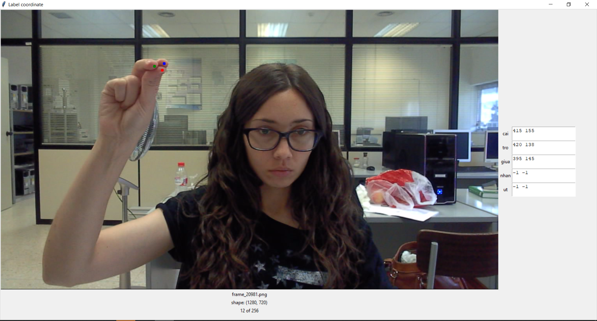
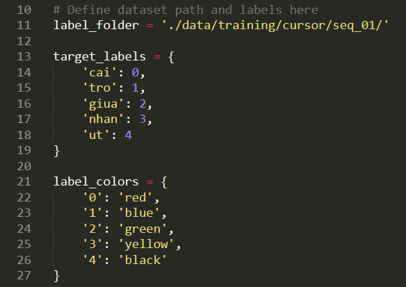

# PixelLabelingTool

## Introduction

This tool is to label pixel(s) as label(s).

For example: label pixel(s) for fingertip(s) in the image (if can be seen), so 1 fingertip has 1 pixel labeled. For unseen fingertip, I hard-codedly set their coordinates to (-1, -1) as default.



*This is an image from the HandGesture Dataset https://www.gti.ssr.upm.es/data/HandGesture_database.html*

## Getting Started

### Installation

```
git clone https://github.com/BiRuVN/PixelLabelingTool.git
```

### Setup dataset path and labels

- Open class_label.py

- Edit this part:



- While you define your own labels, please check other parts in the code to adjust fitting your needs.

## How to use

- Run cmd:

```
python class_label.py
```

- Move your mouse to the coordinate you want.

- Press keyboard, depending on your label define. And it will get current mouse coordinate with that keyboard-pressed label.

- Press keyboard "a" or "d" to go to prev or next image.

- After you press keyboard "a", it will save a txt file containing the label of the image before pressing "a". Pressing "d" won't save.
